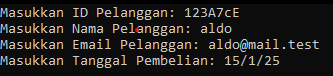
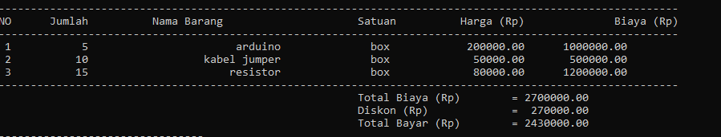
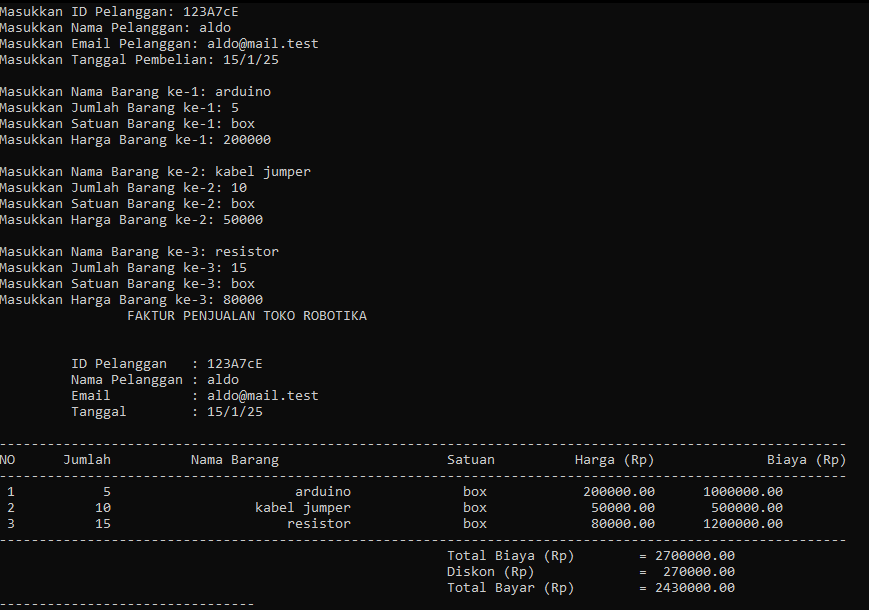

# Faktur Penjualan Toko Robotika

## Informasi Tugas
**Mata Kuliah:** Algoritma C++  
**Nama:** M. Rifaldo Saputra  
**NIM:** 245720111034  
**Kelas:** 1SIA  

---

## Deskripsi Program
Program ini bertujuan untuk membuat faktur penjualan di sebuah toko robotika. Program ini menerima input dari pengguna berupa:  
1. **Informasi Pelanggan**:  
   - ID Pelanggan  
   - Nama Pelanggan  
   - Email  
   - Tanggal Pembelian  
2. **Informasi Barang yang Dibeli**:  
   - Jumlah Barang  
   - Nama Barang  
   - Satuan Barang  
   - Harga Barang  

Program akan menghitung total biaya berdasarkan barang yang dibeli, memberikan diskon sesuai kondisi tertentu, dan menampilkan total pembayaran dalam bentuk tabel.

---

## Fitur Program
1. **Menampilkan Judul Faktur**:  
   Program menampilkan judul faktur sebagai identitas laporan penjualan.  

2. **Informasi Pelanggan**:  
   Program menampilkan informasi pelanggan seperti ID, nama, email, dan tanggal pembelian.  

3. **Tabel Barang yang Dibeli**:  
   Program menampilkan tabel berisi:  
   - Nomor urut barang  
   - Jumlah barang  
   - Nama barang  
   - Satuan barang  
   - Harga barang  
   - Biaya per barang  

4. **Perhitungan Diskon**:  
   Diskon akan diberikan berdasarkan total biaya sebagai berikut:  
   - 5% jika total biaya di antara Rp500.000 - Rp600.000.  
   - 7.5% jika total biaya di antara Rp600.000 - Rp800.000.  
   - 10% jika total biaya di atas Rp800.000.  

5. **Total Pembayaran**:  
   Program menampilkan total biaya, diskon yang diterapkan, dan total yang harus dibayar.

---

## Struktur Program
### 1. **Fungsi `TampilkanJudul1`**  
Menampilkan judul utama dari faktur penjualan.  
**Contoh Keluaran**:  

### 2. **Fungsi `TampilkanJudul2`**  
Menampilkan informasi pelanggan.  
**Parameter**:  
- `idPelanggan` (string)  
- `namaPelanggan` (string)  
- `emailPelanggan` (string)  
- `tanggalPembelian` (string)  
  

### 3. **Fungsi `TampilkanJudul3`**  
Menampilkan tabel barang yang dibeli, serta menghitung total biaya, diskon, dan total pembayaran.  

**Parameter**:  
- `jumlahBarang[3]` (array integer): Jumlah barang.  
- `namaBarang[3]` (array string): Nama barang.  
- `satuanBarang[3]` (array string): Satuan barang.  
- `hargaBarang[3]` (array double): Harga barang.  

   

---

## Alur Program
1. Program meminta input pengguna untuk informasi pelanggan.  
2. Program meminta input pengguna untuk barang yang dibeli.  
3. Program menghitung total biaya barang yang dibeli.  
4. Program menghitung diskon berdasarkan total biaya.  
5. Program menampilkan tabel barang beserta total biaya, diskon, dan total pembayaran.
 
---
